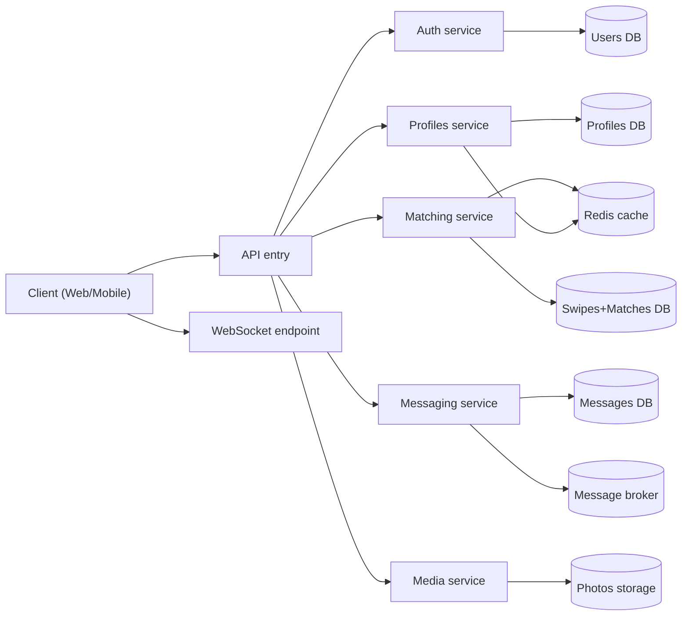
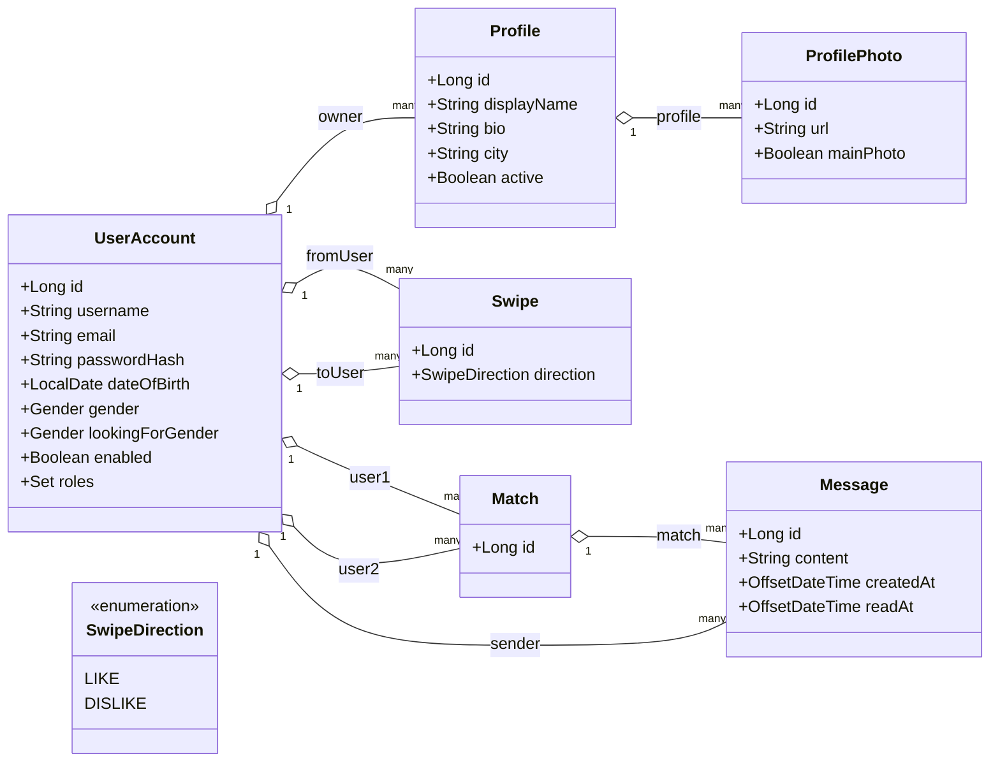
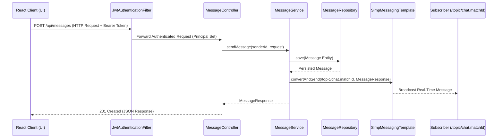
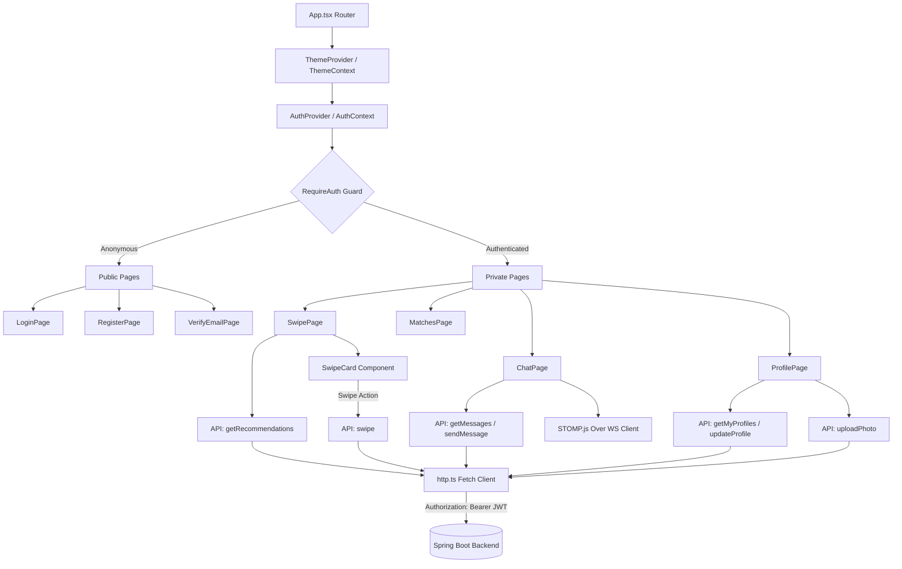
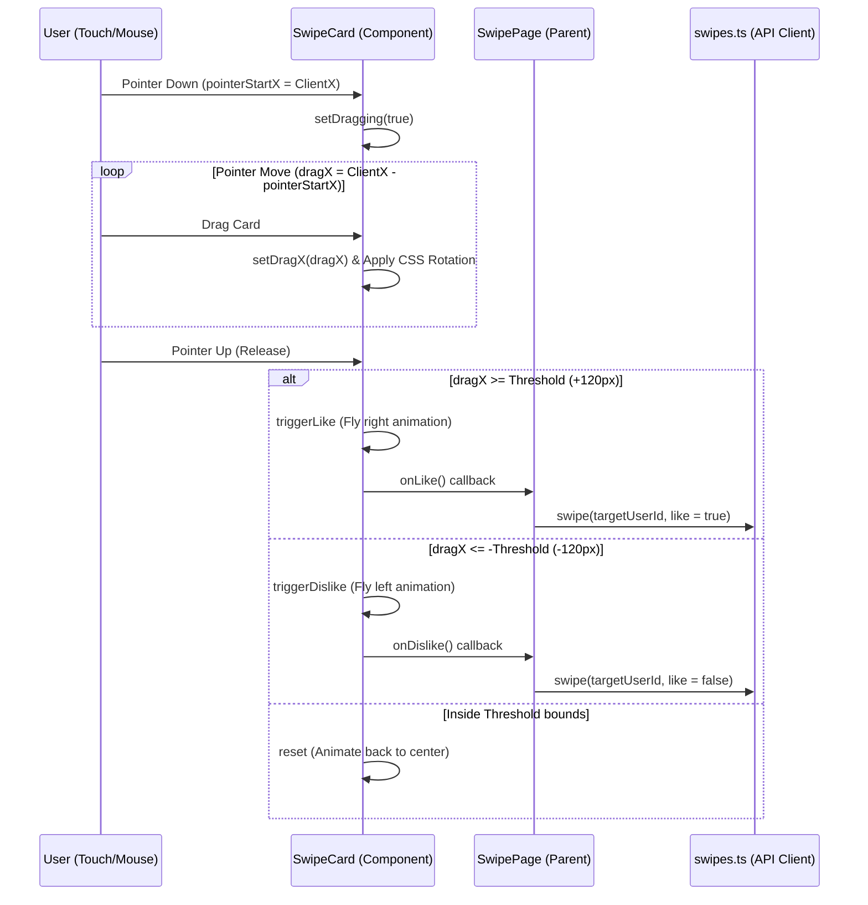

# Architecture Analysis

## Part 1. "To Be" Target Architecture Design

### 1. Application Type

The application belongs to the **REST service** type with **WebSocket (STOMP)** support for real-time message delivery. At its core are key data models — `UserAccount`, `Profile`, `Swipe`/`Match`, `Message`, `ProfilePhoto` — each serviced by a dedicated domain module/service and possessing its own API.

### 2. Deployment Strategy

The project uses **non-distributed modular deployment** with the possibility of further service extraction and isolation of responsibility, as well as an emphasis on environment isolation and ease of local launch.

*   **System Components:**
    *   *Service Level:* Domain modules/services `Auth`, `Profiles`, `Matching` (swipes + matches), `Messaging` (messages + readAt), `Media` (photos).
    *   *Data Level:* Separate schemas/databases for services (migration to *Database per Service*), where users/profiles/swipes/matches/messages are logically separated.
    *   *Caching Level:* A unified caching strategy (e.g., Redis) for "hot" reads (recommendations/profiles) and invalidation control.
    *   *Asynchronous Level:* A message broker (e.g., RabbitMQ/Kafka) for events like `match_created`, `message_sent`, and for scaling the real-time component.

*   **Containerization:** Each service is packaged into an isolated Docker image; `docker compose` is used for local building and launching.
 
*   **Local Launch:** One-click launch of the stack with a single command without manual configuration of the infrastructure (database, cache, broker).

### 3. Technology Stack Justification

| Technology | Purpose | Justification |
| :--- | :--- | :--- |
| **Java 17 & Spring Boot 3.x** | Main development stack | Matches the current application and allows rapid support for REST and STOMP WebSockets. |
| **PostgreSQL** | Main relational DBMS | Reliable support for transactions and relationships between domain entities. |
| **JWT + Spring Security** | Authentication and authorization | Stateless security, convenient integration with `@PreAuthorize` and resource access control. |
| **Redis Cache** | Data caching | Stable TTL and unified invalidation to accelerate the retrieval of recommended profiles/lists. |
| **Docker + `docker compose`** | Deployment | Standardizes environments and simplifies problem reproduction/testing. |

### 4. Quality Attributes

*   **Scalability:** Separating domain logic into modules/services allows scaling the most loaded components (typically `Messaging` and `Matching`) independently of each other.
*   **Performance:** Multi-tier caching reduces the load on the database during frequent requests for reference data.
*   **Supportability:** The codebase is organized according to a clear layered architecture: controllers (handling HTTP requests) → services (business logic) → repositories (data access). The use of DTOs (Data Transfer Objects) separates the internal representation of entities from the data returned to the client, simplifying API changes.
*   **Reliability:** Validation of incoming data at the DTO level using standard annotations (`@NotNull`, `@Size`, etc.) prevents incorrect data from entering the database and business logic.
*   **Testability:** Due to the loose coupling of components (controllers depend on service interfaces, services depend on repository interfaces), unit testing of each layer in isolation is ensured.

### 5. Cross-Cutting Concerns

*   **Exception Handling:** Centralized management of errors through `@RestControllerAdvice` (`GlobalExceptionHandler`), returning unified responses with clear error messages and appropriate HTTP statuses.
*   **Validation:** Application of the Jakarta Bean Validation specification at the DTO level (`@NotNull`, `@Size`, `@Email`). This ensures automatic verification of input data correctness before passing it to the service layer.
*   **Entity Mapping:** Conversion between database entities and DTOs is executed using Lombok and manual mapping in services, ensuring a clear separation between the internal data representation and API contracts.
*   **Caching:** Implemented at two levels: using Spring Cache annotations (`@Cacheable`, `@CacheEvict`) for frequently requested, rarely changed data, and a cache in the service layer to optimize resource-intensive calculations.

### 6. Component Diagram ("To Be")

**Diagram Description:**

1.  **Functional Blocks:** The system is divided into five domain microservices (`Auth`, `Profiles`, `Matching`, `Messaging`, `Media`), each responsible for a specific boundary of the business scope.
2.  **Functional Layers:** Within the services, the API/Controller, Business Logic (Service), and DAO/Repository layers are defined.
3.  **Connections:**
    *   *Synchronous (HTTP/REST):* All client requests pass through a single entry point — the API Gateway, which routes them to the appropriate services based on the request path.
    *   *Data Access:* Direct interaction of services with their own databases and caches, along with asynchronous event handling through the broker.

---

## Part 2. "As Is" Current Monolith Architecture

The current state of `meet_app` is a highly optimized monolithic delivery. The backend handles the core business logic, database persistence, and websocket routing, while the frontend is served statically on the same origin (port `9090`), solving CORS completely.

### 1. Domain Class Diagram

### 2. Message Exchange Sequence Diagram

This diagram demonstrates how messages sent via the REST API POST are captured, written to the database, and immediately broadcasted to the WebSocket topic `/topic/chat.{matchId}` in real-time.

### 3. Frontend Component & Context Architecture ("As Is")

This diagram illustrates how React's component hierarchy, context state providers (`AuthContext`, `ThemeContext`), routing guards, page views, and API layers are organized and interact within the single-page application.

### 4. Swipe Card Pointer Gesture Event Flow ("As Is")

This diagram traces how mouse or touch gestures are captured in the user interface, animated via state transitions, and subsequently communicated to the backend API services.

### 5. Backend Implementation Highlights ("As Is")

*   **Standard Layered Architecture:** The project clearly separates the levels of representation (controllers), business logic (services), and data access (repositories), which simplifies code maintenance.
*   **DTOs as API Contracts:** Request/response payloads are formed through DTOs (`AuthDtos`, `ProfileDtos`, `SwipeDtos`, `MessageDtos`), separating the database model from the public API.
*   **Security (JWT + Spring Security):** Authentication is implemented via `JwtAuthenticationFilter`, and access to resources is restricted using the `@PreAuthorize("hasRole('USER')")` annotation in controllers. Accounts that are not verified (`enabled = false`) are explicitly blocked by the JWT filter.
*   **Rate Limiting:** Request frequency is restricted by the `@RateLimit` annotation and the `RateLimitAspect` implementation, which uses a sliding-window queue over a thread-safe `ConcurrentHashMap` with an `ip:path` key.
*   **Real-time via WebSocket/STOMP:** Messages are dispatched in real-time through the STOMP protocol. A custom `ChannelInterceptor` in `WebSocketConfig.java` intercepts the STOMP `CONNECT` frame to extract and validate the JWT token, safely authenticating the WebSocket session.
*   **File Storage (Photos):** `PhotoService` saves files directly to the absolute operating system directory retrieved from `PhotoStorageProperties`, while `WebConfig` provides public resource mapping via `/photos/**`.
*   **Monolithic Database:** All entities are stored in a single database within a single Spring Boot application. It runs on an in-memory `H2` database by default, with configuration pathways prepared for a seamless production switch to PostgreSQL.
*   **Centralized Error Handling:** `GlobalExceptionHandler` returns a unified `ErrorResponse` format for domain, validation, and JSON parsing errors.

### 6. Frontend Implementation Highlights ("As Is")

*   **Component-Driven SPA Architecture:** Built on React 18 and TypeScript. The interface is composed of independent, highly reusable components and pages (`LoginPage`, `RegisterPage`, `SwipePage`, `MatchesPage`, `ChatPage`), managed client-side via React Router DOM.
*   **Vite Build Tooling:** Next-generation build tool featuring native ES modules for instantaneous development server start and Hot Module Replacement (HMR). The proxy configuration in `vite.config.ts` automatically forwards relative `/api`, `/photos`, and `/ws` requests to the port `9090` backend.
*   **Reactive State Management:** Global states such as authentication tokens (JWT) and user themes (Light/Dark mode) are managed natively via the React Context API (`AuthContext`, `ThemeContext`) and persisted inside `localStorage`.
*   **Custom Drag Gesture Physics (`SwipeCard.tsx`):** Card-swiping mechanics are implemented natively using browser pointer events (`onPointerDown`, `onPointerMove`, `onPointerUp`). Mathematical transformation coordinates mapping translation `X` and rotation are applied dynamically to the CSS. A unique `key={top.id}` forces React to unmount/mount card instances, resetting coordinate state on every swipe.
*   **Optimistic UI Chat Updates:** When a message is sent, the frontend immediately appends it to the local UI state without waiting for the WebSocket or REST server confirmation, achieving zero-latency interaction.
*   **Hook-Based Internationalization (i18n):** Features a lightweight, dependency-free translation pipeline (`i18n.ts`) driven by custom state hooks, enabling complete UI localization swap (RU/EN) in real-time.

---

## Part 3. Comparison and Refactoring

### 1. Architecture Comparison Matrix

| Criteria | "To Be" Target Design (Plan) | "As Is" Current Monolith (Reality) |
| :--- | :--- | :--- |
| **Coupling** | Weak (Independent services with clear REST API contracts) | Moderate (A single Spring Boot monolith sharing a single database) |
| **Orchestration** | API Gateway acting as a single entry point for routing | None (Vite index.html and REST routes served directly on port `9090`) |
| **Layers** | Layered architecture preserving DTO contracts for APIs | Clear Controller/Service/Repository layered separation within the monolith |
| **Fault Tolerance** | Microservice circuit breakers, retry patterns, and fallbacks | None (Exceptions are captured globally by the Global Exception Handler) |
| **Caching** | Unified Redis cache cluster with TTL policies | Local in-memory `LruCache` on recommendation queries |
| **Authentication** | Unified SSO Gateway / OAuth2 | JWT filter verifying signatures locally on every request |
| **Database Isolation** | Database per Service (separate schemas / instances) | Shared database (H2 in-memory, logical separation of JPA tables) |

### 2. Analysis of Differences and Their Reasons

*   **Absence of API Gateway:** In the current "As Is" setup, the client communicates directly with monolithic controllers.  
    **Reason:** Simplicity of development and debugging at the initial stage. Eliminating an extra infrastructure layer accelerates local launches. However, this duplicates cross-cutting concerns (security, logging, rate limiting) within the application.
*   **Shared Monolithic Database:** All entities share a single database, with direct JPA-model relationships.  
    **Reason:** Simplification of transactional and referential integrity (foreign keys between tables). This is typical for the early stages of a project. However, it prevents independent service scaling.
*   **In-Memory Rate Limiting and Caching:** The rate limiter uses a JVM-local sliding window, and the cache uses a custom `LruCache` class.  
    **Reason:** Minimizing external infrastructure dependencies for local setups. If the application is scaled horizontally across multiple servers, a centralized system (such as Redis) is required.
*   **Local File Storage:** Uploaded photos are stored on the local filesystem.  
    **Reason:** Ease of implementation. In a production environment, this must be migrated to a shared object storage solution (such as S3 or MinIO).

### 3. Architectural Refactoring Paths

1.  **Shared Library Implementation:** Extract repeating DTO models, CORS configurations, validation constraints, and utility classes into a standalone shared library module to reduce duplicate definitions.
2.  **API Gateway Integration:** Introduce Spring Cloud Gateway as a single entry point to centralize routing, rate limiting, and edge security protocols.
3.  **Database per Service Migration:** Decouple the database. Move domain tables into isolated schemas or separate database instances, replacing direct JPA relationships with event-driven message queues.
4.  **Distributed Caching & Rate Limiting:** Transition the local `LruCache` and `RateLimitAspect` maps to a Redis cluster to enable distributed state sharing across multiple backend nodes.
5.  **Object Storage Migration:** Refactor `PhotoService` to upload assets directly to an S3-compatible object storage provider, saving only the public URLs in the database.

---

### Conclusion

The current "As Is" architecture is a highly optimized, fully functional monolithic client-server system. It implements crucial production-grade features: state-of-the-art JWT Security, custom sliding-window Rate Limiting, real-time STOMP messaging, and a bundled single-port static delivery. The existing constraints are typical for monolithic designs, and the codebase has been structured with clear domain boundaries, making it fully prepared for a seamless transition to the "To Be" microservices target architecture.

## Credits & Acknowledgements

*   **Backend Foundation:** This project includes modified backend logic originally developed by [@kirirut](https://github.com/kirirut) under the [Meet App](https://github.com/kirirut/meet_app) repository.
*   **Frontend & Modern Features:** The React SPA client, TypeScript migration, dynamic rate limiter aspect, WebSocket token interceptors, and production single-port serving pipeline were designed and implemented by [@vSAQv](https://github.com/vSAQv).
