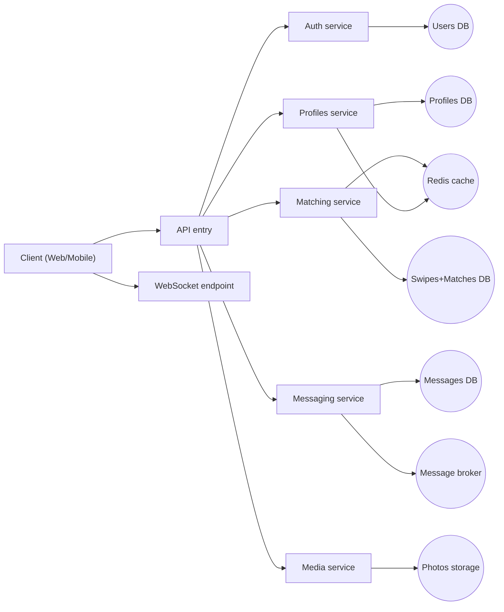
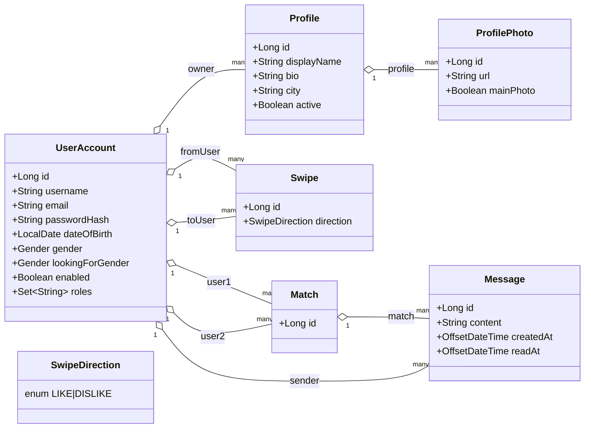
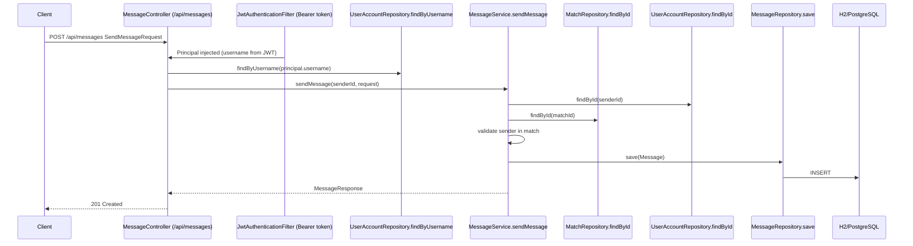

# Анализ архитектуры 

## Часть 1. Проектирование архитектуры «To Be» 

### 1. Тип приложения 

Приложение относится к типу **REST-сервис** с поддержкой **WebSocket (STOMP)** для доставки сообщений в реальном времени. В его основе лежат ключевые модели данных — `UserAccount`, `Profile`, `Swipe`/`Match`, `Message`, `ProfilePhoto` — каждая из которых обслуживается отдельным доменным модулем/сервисом и имеет собственный API. 

### 2. Стратегия развертывания 

Проект использует **нераспределенное модульное развертывание** с возможностью дальнейшего выделения сервисов и изоляции ответственности, а также с акцентом на изоляцию окружений и простоту локального запуска. 

- **Компоненты системы:** 
 - *Сервисный уровень:* доменные модули/сервисы `Auth`, `Profiles`, `Matching` (swipes + matches), `Messaging` (messages + readAt), `Media` (photos). 
 - *Уровень данных:* отдельные схемы/БД под сервисы (миграция к *database per service*), где логически разнесены пользователи/анкеты/свайпы/матчи/сообщения. 
 - *Уровень кэширования:* единая стратегия кэширования (например, Redis) для “горячих” чтений (рекомендации/анкеты) и контроля инвалидаций. 
 - *Уровень асинхронщины:* брокер сообщений (например, RabbitMQ/Kafka) для событий вроде `match_created`, `message_sent` и для масштабирования realtime-части. 

- **Контейнеризация:** каждый сервис упаковывается в отдельный Docker-образ; для локальной сборки и запуска используется `docker compose`. 
 
- **Локальный запуск:** единый запуск стека одной командой без ручной настройки инфраструктуры (DB, cache, broker). 

### 3. Обоснование выбора технологий 

| Технология | Назначение | Обоснование | 
| :--- | :--- | :--- | 
| **Java 17 & Spring Boot 3.x** | Основной стек разработки | Соответствует текущему приложению и позволяет быстро поддерживать REST и STOMP WebSocket. |
| **PostgreSQL** | Основная реляционная СУБД | Надежная поддержка транзакций и связей между доменными сущностями. |
| **JWT + Spring Security** | Аутентификация и авторизация | Stateless безопасность, удобная интеграция с `@PreAuthorize` и контролем доступа к ресурсам. |
| **Redis Cache** | Кэширование данных | Стабильные TTL и единая инвалидация для ускорения выдачи рекомендованных анкет/списков. |
| **Docker + `docker compose`** | Развертывание | Стандартизирует окружения и упрощает воспроизведение проблемы/тестирование. |

### 4. Показатели качества 

- **Масштабируемость:** разделение доменной логики на модули/сервисы позволяет масштабировать наиболее нагруженные компоненты (обычно `Messaging` и `Matching`) независимо. 
- **Производительность:** кэширование часто запрашиваемых данных + снижение нагрузки на БД за счет батчей/индексов и контролируемой инвалидации. 
- **Сопровождаемость (Supportability):** четкое разделение слоев `Controller -> Service -> Repository`, единые DTO для API и предсказуемая обработка ошибок. 
- **Надежность:** валидация входных данных на уровне DTO и согласованные коды ошибок/ответов. 
- **Тестируемость:** слабая связность слоев дает возможность изолированно тестировать сервисы и репозитории. 

### 5. Реализация сквозной функциональности (Cross-cutting functionality) 

- **Обработка исключений:** централизованное управление через `@ControllerAdvice` с унифицированным форматом `ErrorResponse`. 
- **Валидация:** Jakarta Bean Validation (`@NotNull`, `@Size`, `@Email`, `@NotBlank`) на уровне request DTO. 
- **Маппинг сущностей:** DTO отделяют модель БД от внешнего контракта API. 
- **Кэширование:** единая стратегия кэширования (TTL/инвалидации) для “горячих” сценариев чтения. 
- **Ограничение частоты запросов:** Rate Limiting на уровне AOP/filters, чтобы защищать “горячие” эндпоинты (`/swipes`, `/messages`). 
- **Realtime-доставка:** обработка WebSocket событий через STOMP (endpoint `/ws`, topic `/topic`). 

### 6. Структурная схема приложения 

**Описание схемы:** 

1. **Functional Blocks:** доменные модули `Auth`, `Profiles`, `Matching`, `Messaging`, `Media` отвечают за работу с конкретной частью предметной области. 
2. **Functional Layers:** внутри каждого модуля выделены уровни API/Controller, Business Logic (Service) и DAO/Repository. 
3. **Connections:** 
 - **Синхронные (HTTP/REST):** через единую точку входа (API Gateway), маршрутизация по путям к нужному сервису. 
 - **Realtime (WebSocket/STOMP):** клиенты подключаются к `/ws`, а сообщения публикуются в `/topic`. 
 - **Data Access:** прямое взаимодействие сервисов со своими БД и кэшем, а также асинхронные события через брокер. 

--- 

## Часть 2. Анализ архитектуры «As Is» 

В этой части представлена архитектура системы «как она есть», основанная на реальном коде проекта `meet_app`. Для генерации диаграммы классов выбран процесс отправки сообщения в матче (эндпоинт REST + WebSocket), так как он демонстрирует типичный flow работы с доменной сущностью `Message` и связанными сущностями (`Match`, `UserAccount`). 

**Особенности реализации «As Is»:** 

- **Стандартная слоистая архитектура:** в проекте выделены уровни представления (контроллеры), бизнес-логики (сервисы) и доступа к данным (репозитории), что упрощает сопровождение. 
- **DTO как контракты API:** request/response формируются через DTO (например, `AuthDtos`, `ProfileDtos`, `SwipeDtos`, `MessageDtos`), что отделяет модель БД от публичного API. 
- **Безопасность (JWT + Spring Security):** аутентификация реализована через `JwtAuthenticationFilter`, а доступ к ресурсам ограничен методом `@PreAuthorize("hasRole('USER')")` в контроллерах. 
- **Rate limiting:** частота запросов ограничивается аннотацией `@RateLimit` и реализацией `RateLimitAspect`, использующей ключ `ip:path`. 
- **Realtime через WebSocket/STOMP:** сообщения отправляются через `ChatWebSocketController` в топик `/topic/chat.{matchId}` (endpoint `/ws`). 
- **Файловая часть (фото):** `PhotoService` сохраняет файлы на файловой системе (upload-dir), а клиент получает доступ через `WebConfig` с ресурсным маршрутом `/photos/**`. 
- **Монолитная база данных:** все сущности хранятся в одной БД в рамках одного Spring Boot приложения (по умолчанию используется `H2` in-memory; для production логично заменить на PostgreSQL). 
- **Централизованная обработка ошибок:** `GlobalExceptionHandler` возвращает единый формат `ErrorResponse` для доменных и валидационных ошибок. 

--- 

## Часть 3. Сравнение и рефакторинг 

### 1. Сравнение архитектур «As Is» и «To Be» 

| Критерий | Архитектура «To Be» (План) | Архитектура «As Is» (Реальность) | 
| :--- | :--- | :--- | 
| **Связанность** | Слабая за счет разнесения доменов по сервисам/модулям и контрактов API | Умеренная: единый Spring Boot сервис и общая БД для всех сущностей | 
| **Оркестрация** | Через API Gateway и единый входной слой | Отсутствует (клиент обращается напрямую к эндпоинтам одного приложения) | 
| **Слои** | Контроллеры/сервисы/репозитории и DTO для API | Аналогично: `Controller -> Service -> Repository` + DTO | 
| **Отказоустойчивость** | Паттерны таймаутов/ретраев/circuit breaker (например, Resilience4j) | В коде отсутствуют механизмы retry/circuit breaker | 
| **Кэширование** | Единая стратегия (TTL/инвалидации) через Redis | Частично: собственный `LruCache` (и базовый подход к “рекомендациям”) | 
| **Обработка ошибок** | Унифицированные коды/форматы, единые сообщения | Реализовано через `GlobalExceptionHandler` и формат `ErrorResponse` | 
| **Доступ к данным** | Database per Service (разнесение схем/БД) | Единая БД: пользователи, анкеты, свайпы, матчи и сообщения в одной схеме | 
| **Безопасность** | JWT + единая политика доступа по ролям + защита realtime-каналов | JWT и ограничения доступа по ролям уже реализованы; WebSocket опирается на Principal | 

### 2. Анализ отличий и их причины 

- **Отсутствие API Gateway как единой точки входа:** в текущем `As Is` клиент обращается напрямую к эндпоинтам контроллеров `AuthController`, `ProfileController`, `SwipeController`, `MessageController`, `PhotoController`. 
  **Причина:** проще разработка/отладка и меньше инфраструктуры на старте. Для масштабирования и единого контроля трафика gateway становится полезным. 

- **Единая БД и транзакционная модель в рамках одного сервиса:** сущности связаны через JPA-модели (`Message -> Match -> UserAccount`, `Profile -> ProfilePhoto`, `Swipe` с `fromUser/toUser`). 
  **Причина:** скорость разработки и упрощение целостности на этапе прототипа. При масштабировании стоит разносить данные по сервисам и выстраивать события. 

- **Ограниченная стратегия кэширования:** в коде присутствует `CacheConfig` с `LruCache`, но нет унифицированных TTL/инвалидаций уровня инфраструктуры (например, Redis). 
  **Причина:** кэш добавлялся точечно и локально, без общей архитектуры инвалидаций. 

- **Файлы фото на файловой системе:** `PhotoService` сохраняет контент в локальный upload-dir. 
  **Причина:** быстрый старт. В продакшене чаще требуется объектное хранилище (S3/MinIO) и CDN. 

- **Отсутствие отказоустойчивости на уровне интеграций:** текущая архитектура не использует внешние HTTP-вызовы между сервисами (поэтому retry/circuit breaker не внедрялись). 
  **Причина:** приложение монолитное. При выделении сервисов потребуется защита межсервисных запросов. 

### 3. Пути улучшения архитектуры (Рефакторинг) 

1. **Внедрение Shared Library (общая библиотека DTO/ошибок):** чтобы не дублировать `ErrorResponse` и структуры request/response между модулями/сервисами. 
2. **API Gateway и единый входной слой:** для консистентного логирования, rate limiting на уровне edge, маршрутизации и версионирования API. 
3. **Миграция к Database per Service:** разнести данные доменов на отдельные схемы/БД и заменить прямые JPA-зависимости на события и чтение через реплики/проекции. 
4. **Единая стратегия кэширования:** перейти на Redis с TTL и согласованной инвалидацией (например, по событиям `profile_updated`). 
5. **Resilience4j / timeouts / retry:** подготовить инфраструктуру устойчивости на случай межсервисных вызовов. 
6. **Объектное хранилище для фото:** перенести сохранение в MinIO/S3 и хранить только ссылки в `ProfilePhoto`. 

--- 

### Заключение 

Текущая архитектура «As Is» представляет собой работоспособную монолитную систему REST + WebSocket, в которой уже реализованы важные сквозные возможности: JWT Security, Bean Validation, централизованная обработка ошибок, rate limiting и поддержка realtime-чатов. Основные ограничения связаны с монолитностью БД и отсутствием инфраструктурных компонентов уровня gateway/cache/broker, которые становятся актуальными при росте нагрузки и переходе к сервисной архитектуре. 
