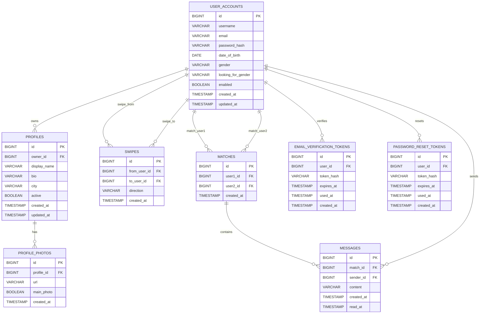

# Сущности базы данных (`meet_app`)

Документ описывает текущие JPA-сущности проекта, их ключевые поля и связи между таблицами.

## 1) `user_accounts` (`UserAccount`)

| Поле | Тип (Java) | Ограничения / смысл |
| :--- | :--- | :--- |
| `id` | `Long` | PK, автоинкремент |
| `username` | `String` | `NOT NULL`, `UNIQUE`, до 50 |
| `email` | `String` | `NOT NULL`, `UNIQUE`, до 255 |
| `passwordHash` | `String` | `NOT NULL` |
| `dateOfBirth` | `LocalDate` | `NOT NULL` |
| `gender` | `Gender` | `NOT NULL`, enum |
| `lookingForGender` | `Gender` | `NOT NULL`, enum |
| `enabled` | `Boolean` | `NOT NULL`, флаг верификации/доступа |
| `roles` | `Set<String>` | роли пользователя (ElementCollection) |
| `createdAt` | `OffsetDateTime` | `NOT NULL` |
| `updatedAt` | `OffsetDateTime` | `NOT NULL` |

Связи:
- `1:N` с `profiles` (`Profile.owner`)
- используется в `swipes` как `from_user_id` и `to_user_id`
- используется в `matches` как `user1_id` и `user2_id`
- `1:N` с `messages` (`sender_id`)
- `1:N` с токенами `email_verification_tokens` и `password_reset_tokens`

---

## 2) `profiles` (`Profile`)

| Поле | Тип (Java) | Ограничения / смысл |
| :--- | :--- | :--- |
| `id` | `Long` | PK, автоинкремент |
| `owner` | `UserAccount` | FK `owner_id`, `NOT NULL` |
| `displayName` | `String` | `NOT NULL`, до 100 |
| `bio` | `String` | до 500 |
| `city` | `String` | до 100 |
| `active` | `Boolean` | `NOT NULL` |
| `createdAt` | `OffsetDateTime` | `NOT NULL` |
| `updatedAt` | `OffsetDateTime` | `NOT NULL` |

Связи:
- `N:1` к `user_accounts`
- `1:N` к `profile_photos`

---

## 3) `profile_photos` (`ProfilePhoto`)

| Поле | Тип (Java) | Ограничения / смысл |
| :--- | :--- | :--- |
| `id` | `Long` | PK, автоинкремент |
| `profile` | `Profile` | FK `profile_id`, `NOT NULL` |
| `url` | `String` | `NOT NULL`, до 500 |
| `mainPhoto` | `Boolean` | `NOT NULL` |
| `createdAt` | `OffsetDateTime` | `NOT NULL` |

Связи:
- `N:1` к `profiles`

---

## 4) `swipes` (`Swipe`)

| Поле | Тип (Java) | Ограничения / смысл |
| :--- | :--- | :--- |
| `id` | `Long` | PK, автоинкремент |
| `fromUser` | `UserAccount` | FK `from_user_id`, `NOT NULL` |
| `toUser` | `UserAccount` | FK `to_user_id`, `NOT NULL` |
| `direction` | `SwipeDirection` | `NOT NULL`, enum (`LIKE` / `DISLIKE`) |
| `createdAt` | `OffsetDateTime` | `NOT NULL` |

Связи:
- `N:1` к `user_accounts` (два поля-ссылки: отправитель и получатель свайпа)

---

## 5) `matches` (`Match`)

| Поле | Тип (Java) | Ограничения / смысл |
| :--- | :--- | :--- |
| `id` | `Long` | PK, автоинкремент |
| `user1` | `UserAccount` | FK `user1_id`, `NOT NULL` |
| `user2` | `UserAccount` | FK `user2_id`, `NOT NULL` |
| `createdAt` | `OffsetDateTime` | `NOT NULL` |

Связи:
- `N:1` к `user_accounts` (два поля-ссылки: участники матча)
- `1:N` к `messages`

---

## 6) `messages` (`Message`)

| Поле | Тип (Java) | Ограничения / смысл |
| :--- | :--- | :--- |
| `id` | `Long` | PK, автоинкремент |
| `match` | `Match` | FK `match_id`, `NOT NULL` |
| `sender` | `UserAccount` | FK `sender_id`, `NOT NULL` |
| `content` | `String` | `NOT NULL`, до 1000 |
| `createdAt` | `OffsetDateTime` | `NOT NULL` |
| `readAt` | `OffsetDateTime` | nullable |

Связи:
- `N:1` к `matches`
- `N:1` к `user_accounts`

---

## 7) `email_verification_tokens` (`EmailVerificationToken`)

| Поле | Тип (Java) | Ограничения / смысл |
| :--- | :--- | :--- |
| `id` | `Long` | PK, автоинкремент |
| `user` | `UserAccount` | FK `user_id`, `NOT NULL` |
| `tokenHash` | `String` | SHA-256 токена |
| `expiresAt` | `OffsetDateTime` | срок действия |
| `usedAt` | `OffsetDateTime` | время использования (nullable) |
| `createdAt` | `OffsetDateTime` | время создания |

Связи:
- `N:1` к `user_accounts`

---

## 8) `password_reset_tokens` (`PasswordResetToken`)

| Поле | Тип (Java) | Ограничения / смысл |
| :--- | :--- | :--- |
| `id` | `Long` | PK, автоинкремент |
| `user` | `UserAccount` | FK `user_id`, `NOT NULL` |
| `tokenHash` | `String` | SHA-256 токена |
| `expiresAt` | `OffsetDateTime` | срок действия |
| `usedAt` | `OffsetDateTime` | время использования (nullable) |
| `createdAt` | `OffsetDateTime` | время создания |

Связи:
- `N:1` к `user_accounts`

---

## ER-диаграмма (Mermaid)

